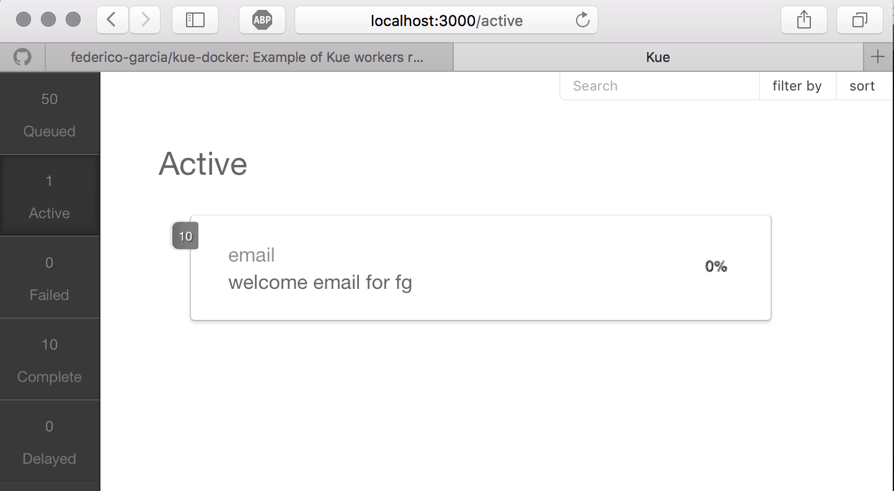

Kue in Docker
=========

Getting started
---------------

Download [Docker for Mac or Windows](https://www.docker.com).

Clone this repo and run this command to start the application:

    $ docker-compose up

The kue dashboard will be running at [http://localhost:3000](http://localhost:3000).

The way the project is innitally set-up, the number o jobs in the queue will contnue growing since the worker is not able to keep pace with the rate at which jobs are created.

You can scale up the worker app to process more jobs. See what happens if you add 5, then 10, 30, 50

    $ docker-compose scale worker=5

You can scale up the producer app to create more jobs

    $ docker-compose scale producer=3

With the same command above, you can scale down the number of worker/producer containers running by entering a number which is less than the number of running instances currently running.

You can stop and remove all containers

    $ docker-compose down

If you have any questions or run into any problems, please create an issue!

That's all!